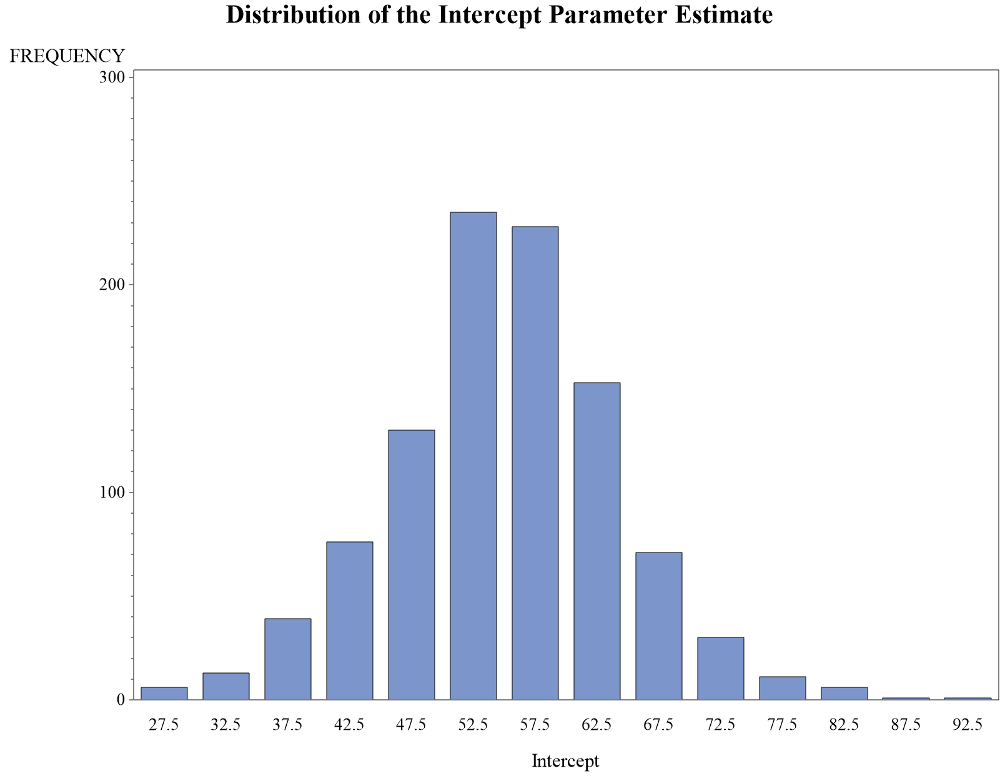
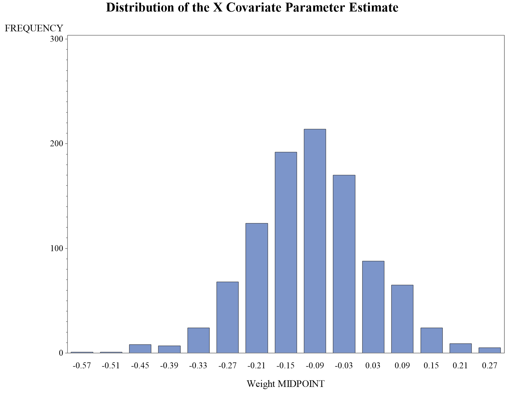
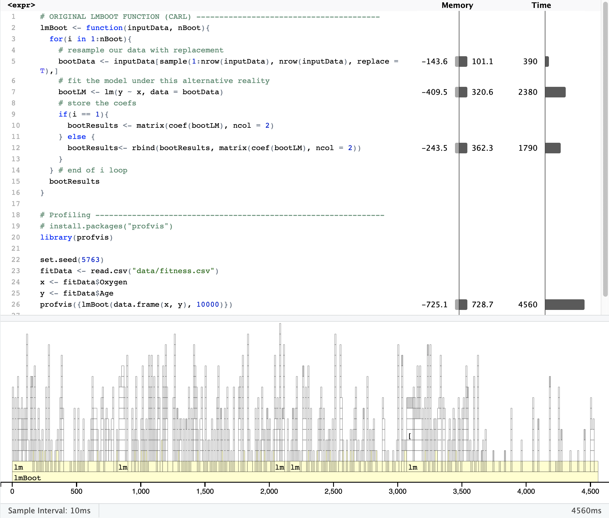
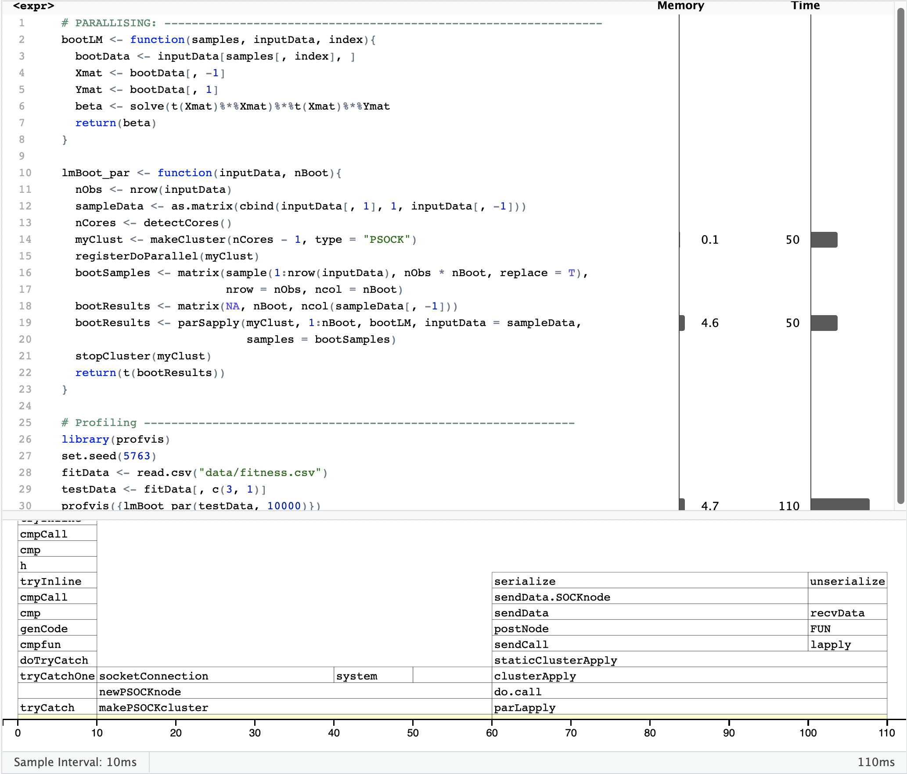

\pagebreak

## Introduction 

Bootstrapping is a nonparametric approach to statistical inference that implements Monte Carlo type simulations whereby a sampling distribution is built by generating a large number of random samples from the original dataset. Repeating calculations a large number of times, say 1000000 times, can become slow to compute. Therefore, the use of efficient and fast code is essential.

This is project aimed to improve and produce two fast and efficient bootstrap functions. The original functions to be improved were provided by Donovan (2018). The function *lmBoot* was improved using R 3.5.1 software (R, 2018), while the program *SASBoot* was improved using SAS 9.4 (SAS Institute, Cary NC) software. 

A short example analysis was given for each function. The fitness dataset from Rawlings (1998) contains measurements of the following seven variables obtained from 31 men:

• Age: Age in years  
• Weight: Weight in kg  
• Oxygen: Oxygen intake rate, ml per kg body weight per minute  
• RunTime: time to run 1.5 miles in minutes  
• RestPulse: heart rate while resting  
• RunPulse: heart rate at end of run  
• MaxPulse: maximum heart rate recorded while running 

A linear model was set up in each analysis and the bootstrap was used to generate confidence intervals for each of the covariates of intervals. Conclusions to hypothesis tests about the significance of the relationship between the response and the parameter estimates can be drawn using bootstrap methods depending on whether the confidence interval contains zero, one then fails to reject the null hypothesis, or if it does not contain zero, one can reject the null hypothesis.


\pagebreak

## R 

### *The function lmBoot*

The function *lmBoot* uses bootstrap sampling methods to calculate parameter estimates for the intercept and slope parameters produced by a linear regression. 

The function takes in two arguments:

- inputData: the dataset that will be used for sampling, where the response variable is in the first column and the remainder of the columns contain the covariates of interest.
- nBoot: The number of bootstrap samples to compute.

The function outputs:

- BootResults: An array with the number of rows equivalent to the nBoot argument and as many columns as there are Beta coeficients; i.e. for the intercept and covariates.
 
### *Changes made to lmBoot*
1. The function *lmBoot_imp* (see Appendix A.2) was the result of three major changes to *lmBoot*.
  + The original *lmBoot* function only produced bootstrap samples for one covariate while *lmBoot_imp* produces bootstrap estimates for a multiple number of covariates. 
  + The use of the *lm* function was removed and the beta coefficients were calculated using matrix calculations instead. 

$$
\beta = (X^TX)^{-1}X^TY
$$

  + *forloops* are relatively slow and inefficient. Therefore, the *forloop* was replaced using *sapply* which applies a function to each element of a matrix. The function called *bootLM* (see Appendix A.1) was written to carry out the bootstrap algorithm. 

2. The function *lmBoot_par* (see Appendix A.3) further improves *lmBoot_imp* using parallisation. This allows the the execution of the function to be split up across multiple cores rather than just using 1. (The results for execution times of *lmBoot_par* produced in this report were produced using three cores).

Table 1 illustrates differences in runtime for three different versions of the lmBoot function; the original, an improved version and a parallelised version. Each function was timed on how long it took to resample 100, 1000, 10000, 100000 and 1000000 samples.


Table: Changes in Runtime (in seconds) of lmBoot

Samples   lmBoot    lmBoot Improved   lmBoot Parallised 
--------  --------  ----------------  ------------------
100       0.079     0.025             1.337             
1000      0.941     0.134             0.893             
10000     8.502     0.777             1.148             
1e+05     127.289   6.604             3.81              
1e+06     -         87.17             40.999            

Original boot fucntion (lmBoot) run speed for 100,000 samples = 127.289 secs
Final boot function (lmBoot_4) run speed for 100,000 samples = 0.37 secs
Overall speed increase was seen to be 126.919 secs. 

Each function was also profiled for the execution of 10000 samples, the results for which can be found in Appendix A.4. 

### *Microbenchmark*
Table 2 contains the results of microbenchmark comparison between the builtin *Boot* function and the final *lmBoot_par* function. Each function was executed 10 times and the mean time taken to run the function is shown. The microbenchmark was run for 100, 1000, 10000 and 100000 samples. For smaller numbers of samples, less than 1000 samples, the *Boot* function executes faster than the *lmBoot_par* function. However, as the sample size increases *lmBoot_par* performs faster than the *boot* function.


Table: Microbenchmark comparison (in milliseconds) between lmBoot_par and Boot

 Samples   lmBoot_par         Boot
--------  -----------  -----------
   1e+02     922.0006     198.1029
   1e+03    1306.5800    1822.5090
   1e+04    1534.3260   16156.0050
   1e+05       5.7670     151.1306

### *Example analysis using lmBoot*

An example analysis was conducted using the fitness data set. A linear model was set up with Oxygen as the response and the remaining six variables as the predictors. The bootstrap 95% confidence intervals produced by lmBoot_par were then used to test the null hypothesis that there is no relationship between Oxygen and each covariate, i.e. $\beta_i = 0$. 


Table: 95% Confidence Intervals for Parameter Estimates

               2.5%     97.5%
----------  -------  --------
Intercept    79.660   121.086
Age          -0.435    -0.008
Weight       -0.162     0.063
RunTime      -3.293    -1.843
RestPulse    -0.180     0.098
RunPulse     -0.558    -0.084
MaxPulse     -0.040     0.522

 

Table 3 displays the 95% confidence intervals for the estimates of the intercept and six covariates used in the linear regression. Figure 1 illustrates the distribution of 10000 bootstrap estimates for the same parameters. The confidence intervals for the Age, RunTime, and RunPulse parameter estimates do not contain zero, suggesting that there is evidence to conclude that a significant relationship exists between Oxygen and these covariates at the 5% level of significance. The confidence intervals for the Weight, RestPulse, and MaxPulse parameter estimates do contain zero, suggesting that there is evidence to conclude that there is not a significant relationship between Oxygen and these covariates at the 5% level of significance. 

\pagebreak 

## SAS 

### *The program SASBoot*

The macro program *SASBoot* (Appendix A.6) uses bootstrap sampling methods to calculate estimates for the means and confidence intervals of the slope and intercept parameters produced by a linear regression. 

It takes in four agruments:

- NumberOfLoops: the number of bootstrap iterations.
- DataSet: A SAS dataset containing the response and covariate.
- XVariable: The covariate for our regression model (gen. continuous numeric).
- YVariable: The response variable for our regression model (gen. continuous numeric).

The program then outputs:

- ResultHolder: A SAS dataset with the number of rows equivalent to the NumberOfLoops argument and two columns; RandomIntercept and RandomSlope. 
- output.rtf: An RTF file containing 95% confidence intervals for the mean, the mean estimate for each parameter and plots of the distributions of the bootstrap parameters.
 
The function makes use of:

- MACRO statements to create a flexible program with input arguments.
- PROC SURVEYSELECT which allows the use of random sampling to generate random samples from a selected or inputed dataset.
- PROC REG to perform a linear regression.
 
### *Changes made to SASBoot*

The changes made to SASBoot were motivated, in part, by the work of Cassel (2018) in his paper "Don't Be Loopy: Re-Sampling and Simulation the SAS® Way".

1. The %do% loop was first removed and the following code was added to PROC SURVEYSELECT:  
*samprate = 1*  
*outhits*  
*rep = &NumberOfLoops*    

which ensures that NumberOfLoops samples of the same size as the original data set are produced and recorded.

2. A linear regression using PROC REG was improved by introducing the by-variable REPLICATE. This variable is automatically produced from PROC SURVEYSELECT to keep track of each new bootstrap sample, and ensures that the linear regression is run on each sample. Thus, only the Result Holder Dataset was necessary, and there was no need to generate the Temp Dataset.

3. The SASFILE statement was included to upload the dataset to RAM rather than the hard drive before any sampling was carried out so that the dataset does not have to be read-in every time a resample is done.

The program was run over increasingly large numbers of replications and Table ### displays the runtime (in seconds) for each function. The code used to measure the run time of the SASBoot program can be found in Appendix A.8 (H, 2012).


Table: Changes in Runtime of SASBoot

Samples   RegBoot    SASBoot   SASBoot (with rtf  output) 
--------  ---------  --------  ---------------------------
100       17.868     0.235     4.828                      
1000      169.445    0.265     5.159                      
10000     1732.052   0.714     6.535                      
100000    -          5.22      11.381                     

### *Example analysis using SASBoot*

An example analysis was conducted using the fitness dataset. A linear model was set up with Oxygen as the response and Weight as the covariate. The bootstrap 95% confidence intervals produced by SASBoot were then used to test the null hypothesis that there is no significant relationship between Oxygen and Weight, i.e. $\beta_i = 0$. 


Table: 95% Confidence Intervals for Parameter Estimates

Parameter   2.5%       97.5%   
----------  ---------  --------
Intercept   36.4824    73.159  
Weight      -0.32842   0.13533 

Table 5 displays the 95% confidence intervals for the estimates of the intercept and Weight parameters. Figure 2 and Figure 3 illustrate the distribution of 1000 bootstrap estimates for the intercept and Weight parameters. The confidence interval for the intercept term (36.48, 73.15) does not contain 0 which suggested that the estimator is not signicant at the 5% level. The confidence interval for Weight (-0.32, 0.13) did contain 0 which suggested that the estimator is signicant at the 5% level.

{ width=75% }

{ width=75% }


\pagebreak 

## References
Cassell, D. (2018). Don't Be Loopy: Re-Sampling and Simulation the SAS® Way. [online]. Available at: http://www2.sas.com/proceedings/forum2007/183-2007.pdf [Accessed 26 Oct. 2018].

Donovan, C. (2018). MT5763 Project 2 - code collaboration and computer intensive inference. [Online].

H, J. (2012). To calculate SAS program run time. [online]. Available at: http://sashowto.blogspot.com/2012/06/to-calculate-sas-program-run-time.html [Accessed 26 Oct. 2018].

R Core Team (2018). R: A language and environment for statistical computing. R Foundation for Statistical Computing, Vienna, Austria. Available at: https://www.R-project.org/.

SAS 9.4, SAS Institute Inc., Cary, NC, USA.

\pagebreak 

## Appendix

### A.1 The Bootlm Function


```r
bootLM <- function(samples, inputData, index){
  #Purpose: Generate the linear regression beta coefficients
  #Inputs: samples: a dataframe containing the indices for the bootstrap samples
  #        inputData: a dataframe containing the response variable, which must be 
  #        in the first column of the dataframe, and the covariates of interest
  #        index: the index of the position in the BootResults that Bootlm 
  #        should be applied to
  #Outputs: Beta: An matrix containing the parameter estimates from a linear 
  #         regression
  
  bootData <- inputData[samples[, index], ]
  Xmat <- bootData[, -1]
  Ymat <- bootData[, 1]
  beta <- solve(t(Xmat)%*%Xmat)%*%t(Xmat)%*%Ymat
  return(beta)
}
```

### A.2 The lmBoot_imp Function


```r
lmBoot_imp <- function(inputData, nBoot){
  #Purpose: Generate a large number of linear regression beta coefficients using
  #         bootstrap methods.
  #Inputs: inputData: a dataframe containing the response variable, which must be 
  #        in the first column of the dataframe, and the covariates of interest
  #        nBoot: the number of bootstrap samples to generate.
  #Outputs: BootResults: An arraycontaing the parameter estimates of each 
  #         each bootstrap sample.
  #         ConfidenceIntervals: A matrix containing 95% confidence intervals 
  #         for each parameter.
  
  #Calculate the number of observations in the dataset 
  nObs <- nrow(inputData)
  
  #Create a sample dataset with a column of 1s for the intercept
  sampleData <- as.matrix(cbind(inputData[, 1], 1, inputData[, -1]))
  
  # Create the a matrix of indices for the bootstrap samples
  bootSamples <- matrix(sample(1:nrow(inputData), nObs * nBoot, replace = T), 
                        nrow = nObs, ncol = nBoot)
  
  #Create an empty array to store results
  bootResults <- array(dim = c(nBoot, ncol(sampleData[, -1]))) 

  #Use sapply to apply bootLM to bootResults matrix
  bootResults <- sapply(1:nBoot, bootLM, inputData = sampleData, 
                        samples = bootSamples)
  bootResults <- t(as.matrix(bootResults))
  
  return(bootResults)
}
```

### A.3 The lmBoot_par Function


```r
library(doParallel)

lmBoot_par <- function(inputData, nBoot){
  #Purpose: Generate a large number of linear regression beta coefficients using
  #         bootstrap methods.
  #Inputs: inputData: a dataframe containing the response variable, which must be 
  #        in the first column of the dataframe, and the covariates of interest
  #        nBoot: the number of bootstrap samples to generate.
  #Outputs: BootResults: An arraycontaing the parameter estimates of each 
  #         each bootstrap sample.
  #         ConfidenceIntervals: A matrix containing 95% confidence intervals 
  #         for each parameter.
  
  #Calculate the number of observations in the dataset 
  nObs <- nrow(inputData)
  
  #Create the sample data with 1s for the intercept
  sampleData <- as.matrix(cbind(inputData[, 1], 1, inputData[, -1]))
  
  #Set up parallisation
  nCores <- detectCores()
  myClust <- makeCluster(nCores - 1, type = "PSOCK")
  registerDoParallel(myClust)
  
  # Create the samples
  bootSamples <- matrix(sample(1:nrow(inputData), nObs * nBoot, replace = T), 
                        nrow = nObs, ncol = nBoot)
  
  #Use parallised sapply to apply bootLM to bootResults matrix
  bootResults <- matrix(NA, nBoot, ncol(sampleData[, -1]))
  bootResults <- parSapply(myClust, 1:nBoot, bootLM, inputData = sampleData, 
                           samples = bootSamples)

  #Close parallisation
  stopCluster(myClust)
  
  return(t(bootResults))
}
```


\pagebreak

### A.4 R Profiles for *lmBoot*, *lmBoot_imp* and *lmBoot_par*

{width=69%} 

{width=69%} 

{width=69%} 


\pagebreak

### A.5 Bootstrap Example Analysis with R


```r
library(dplyr)

fitData <- read.csv("data/fitness.csv")
testData <- fitData %>% select(Oxygen, everything())
set.seed(5763)
testResults <- lmBoot_par(testData, 10000)

#Plot the distributions for each parameter
par(mfrow = c(4,2))
for(i in 1:ncol(testResults)){
  hist(testResults[, i], breaks = 50, 
       main = "", xlab = paste("Parameter Esimates of ", names(testResults[i])))
}
  
#Confidence intervals
ciMatrix <- matrix(NA, nrow = ncol(testResults), ncol = 2)
for(i in 1:ncol(testResults)){
  ciMatrix[i, ] <- quantile(testResults[,i], probs = c(0.025, 0.975))
}
colnames(ciMatrix) <- c("2.5%", "97.5%")
rownames(ciMatrix) <- c("Intercept", names(testData[-1]))
```

### A.6 The SASBoot Program


```r
%macro SASBoot(NumberOfLoops, DataSet, XVariable, YVariable);

/* Load data set to RAM and generate random samples of the data */
/*       sasfile &DataSet load;*/
       proc surveyselect data=&DataSet out=BootData seed=-23434 noprint
       method=urs samprate=1 outhits rep=&NumberOfLoops;
       run;
/*       sasfile &DataSet close;*/

/*Calculate and store the parameter estimates*/

       proc reg data=BootData outest=ParameterEstimates(drop=_:) noprint;
       model &YVariable=&XVariable;
       by replicate;
       run;

/*Extract and store the columns for the intercept and X covariate*/

       data ResultHolder;
       set ParameterEstimates;
       keep Intercept &XVariable;
       run;

/*Calculate the means of the X covariate of every bootstrap sample*/

       proc univariate data=BootData noprint;
       var &XVariable;
       by replicate;
       output out=uniOut mean=mean&XVariable;
       run;

/*Calculate 95% confidence intervals for the mean of the intercept parameter estimates*/

       proc univariate data=ResultHolder;
       var Intercept;
       output out=InterceptCI pctlpts=2.5, 97.5 pctlpre=CI; 
       run;

/*Calculate 95% confidence intervals for the mean of X covariate parameter estimates*/

       proc univariate data=ResultHolder;
       var &XVariable;
       output out=XvarCI pctlpts=2.5, 97.5 pctlpre=CI; 
       run;

	   /*Create output RTF file*/

       ods rtf file="output.rtf" bodytitle startpage = never;
		title1 "Drunken Master 2";
		title2 "Results of SAS Bootstrap Program";

		title4 "95% Confidence Interval for the Intercept Parameter Estimate";

        /*Results for the intercept parameter estimate*/

        proc print data=InterceptCI;
        run;
		title "Distribution of the Intercept Parameter Estimate";
        proc gchart data=ResultHolder;
        vbar Intercept;
        run;

        /*Results for the X covariate parameter estimate*/

        ods startpage = now;
		title "95% Confidence Interval for the X Covariate Parameter Estimate";
        proc print data=XvarCI;
        run;

		title "Distribution of the X Covariate Parameter Estimate";
        proc gchart data=ResultHolder;
        vbar &XVariable;
        run;

        ods rtf close;

%MEND SASBoot; /*End of SASBoot macro*/
```

### A.7 Bootstrap Example Analysis with SAS


```r
/*Importing the fitness data set*/

proc import out = Asmt2.fitness 
   datafile = "C:\Users\baf3\Desktop\fitness.csv" 
   dbms = CSV REPLACE;
   getnames = YES;
   datarow = 2; 
run;

%SASBoot(NumberOfLoops=1000, DataSet=Asmt2.fitness, XVariable=Weight, YVariable=Oxygen);
```

### A.8 Code to measure program runtime in SAS


```r
%let _sdtm=%sysfunc(datetime());

  Program of interest to be timed

%let _edtm=%sysfunc(datetime());  
%let _runtm=%sysfunc(putn(&_edtm - &_sdtm, 12.4));  
%put It took &_runtm seconds to run the program;
```
